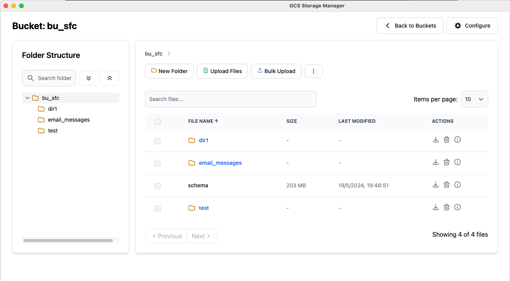

# Google Cloud Storage Manager

Google Cloud Storage Manager is an Electron-based desktop application that provides a user-friendly interface for managing your Google Cloud Storage buckets and files. Built with React and TypeScript, it offers a seamless experience for interacting with your cloud storage directly from your desktop.

## Features

- **Bucket Management**: View and select from your GCS buckets.
- **File Browser**: Navigate through your folder structure with an intuitive interface.
- **File Operations**:
  - Upload individual files
  - Bulk upload of entire directories
  - Download files (individual and bulk)
  - Delete files and folders (individual and bulk)
  - Create new folders
  - Rename folders
  - File preview for images and PDFs
- **Search Functionality**: Quickly find files and folders within your buckets.
- **Folder Tree View**: Easily navigate complex folder structures.
- **Dark Mode Support**: Comfortable viewing in low-light environments.
- **Progress Tracking**: Real-time progress bars for file uploads and downloads.
- **Contextual Actions**: Right-click context menu for quick actions on files and folders.

## Installation

You can download the latest version of Google Cloud Storage Manager for your operating system from the [Releases](https://github.com/pueteam/gcs-storage-manager/releases) page of this repository.

### Windows
- Download the `.exe` file from the latest release.
- Run the downloaded file to install the application.

### macOS
- Download the `.dmg` file from the latest release.
- Open the `.dmg` file and drag the application to your Applications folder.

### Linux
- Download the `.AppImage` file from the latest release.
- Make the file executable: `chmod +x GoogleCloudStorageManager.AppImage`
- Run the application: `./GoogleCloudStorageManager.AppImage`

After installation, you'll need to configure the application with your Google Cloud Project ID and the path to your service account key file when you first run it.

## Usage

1. Launch the Google Cloud Storage Manager application.

2. When you first run the application, you'll need to configure it with your Google Cloud Project ID and the path to your service account key file.

3. Once configured, you can:
   - Select a bucket from the list of available buckets.
   - Navigate through your folder structure using the folder tree or file browser.
   - Upload individual files by clicking the "Upload Files" button.
   - Perform bulk uploads of entire directories using the "Bulk Upload" feature.
   - Download files individually or in bulk.
   - Create new folders using the "New Folder" button.
   - Rename or delete folders and files using the context menu (right-click).
   - Search for files and folders using the search bar.
   - Preview PDFs and images by clicking the eye icon.
   - Monitor upload and download progress with real-time progress bars.
   - Use the expand/collapse buttons to manage the folder tree view.
   - Perform bulk actions like delete and download using the "More Options" dropdown menu.

## Contributing

Contributions to Google Cloud Storage Manager are welcome! Please feel free to submit a Pull Request.

## License

This project is licensed under the MIT License - see the [LICENSE](LICENSE) file for details.

## Author

[Sergio Rodríguez de Guzmán at PUE Team] - [https://github.com/pueteam]

## Acknowledgments

- This project was bootstrapped with [Electron React Boilerplate](https://electron-react-boilerplate.js.org/).
- Icons provided by [Heroicons](https://heroicons.com/).

## Support

If you encounter any problems or have any questions, please open an issue on the GitHub repository.
